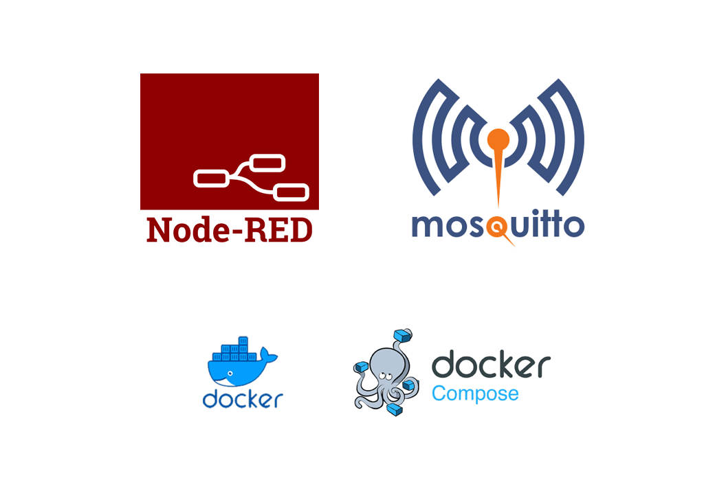
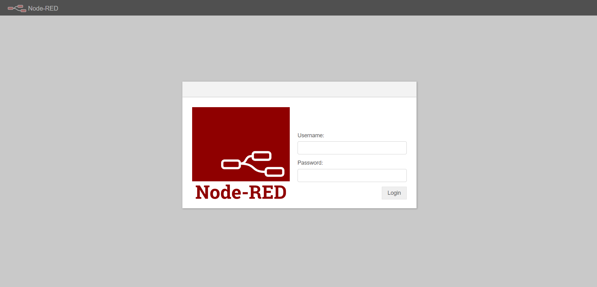
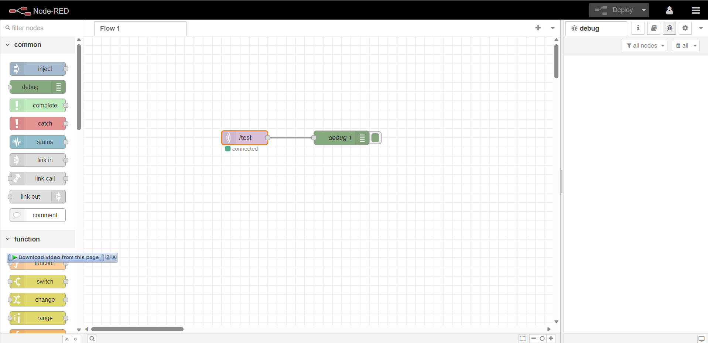
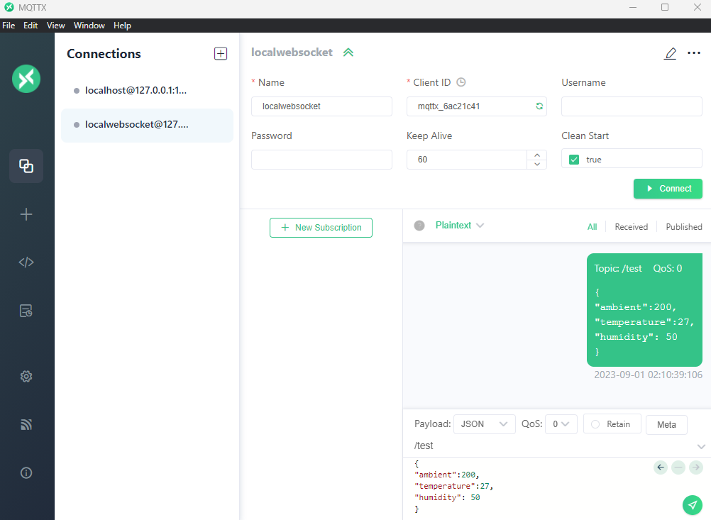

<h1 align="center">NodeRed and Mosquitto Docker </h1>


<div align="center" ><a href="https://easy-iot.ir"></a></div>

<h3 align="center">the most minimal setup for mosquitto and nodered setup to control devices though mqtt</h3>

### Overview
- [Setup](#setup)
- [Configs](#configs)
  - [mosquitto config](#mosquitto-config)
  - [nodered config](#nodered-config)
- [Usage](#usage)
  - [nodered mqtt connection](#nodered-mqtt-connection)
  - [outsider mqtt connection](#outsider-mqtt-connection)
- [License](#license)
- [Bugs or Opinion](#bugs-or-opinion)


# Setup
in order to setup both mosquitto and nodered in your server or even your desktop environment all you have to do is to build and run the ```docker-compose.yml``` file that i have included in the repo with the minimal configurations.
all you have to do is to have docker installed and just run the following command in the directory:

```shell
# for the first time
docker-compose up --build -d

# after next stop
docker-compose up -d
```
you can also stop or eliminate the service by calling the following command in the same directory:
```shell
docker-compose stop
docker-compose down
```

# Configs
there are two important configuration files in the repo, one for the mosquitto and one for the nodered.

## mosquitto config
the mosquitto config file is located at ```mosquitto/config/mosquitto.conf``` file which will tell the broker to be able to listen to ports 1883 for tcp connections and 9001 for websocket connections and also presistent data in the db and also logs. also include a config to tell broker that anyone can subscribe to the topics and connect to broker cause no acl is included.
```conf
# mosquitto.conf

persistence true
persistence_location /mosquitto/data/
log_dest file /mosquitto/log/mosquitto.log

## Authentication ##
allow_anonymous true

listener 1883

listener 9001
protocol websockets
```

## nodered config
nodered config file can be located at ```nodered/settings.js``` file which is including all the default configs and also a little additional security for loggin. based on the following configurations when you want to reach port 1880 in the browser first of all you will be asked for the username and the password and after that you can proceed to use the nodered.
```js
 adminAuth: {
          type: "credentials",
          users: [
            {
              username: "admin",
              password: "$2b$08$qZ8kK3iTPOVeJVmt1qoWhORehvmR6W2PzfNnguWWx4pHSh4V1Q/GC",
              permissions: "*",
            },
          ],
        },
```

in case you wanted to change the default password which is ```admin``` you can try creating it with the following command while the nodered is running and replace it with the current config and again restart the service.
```shell
docker-compose exec nodered sh -c "node-red admin hash-pw"
```
you will be asked to enter a password and then you will get the hashed password and you can replace it.


# Usage
in order to use the nodered all you have to do is to head http://address:1880 and will be asked for the user and password which by default is ```username: admin ``` and ```password:admin``` after that you can access the nodered.
<div align="center" ></div>
## nodered mqtt connection
also if you want to connect to mqtt though the nodered you have to use one of the nodes and create the configs with the following details:
```
name: anything 
server: mosquitto
port: 1883
username: 
password:
protocol: MQTT V3.1.1
anything else will be default
```
<div align="center" ></div>
## outsider mqtt connection
as you have seen in the docker-compose file the port 1883 and also 9001 are shared with the host and you can use any application or service to connect to mqtt outside of the docker service, like mqttx.
<div align="center" ></div>

# License
MIT

# Bugs or Opinion
Feel free to let me know if there are any problems or any request you have for this repo.
